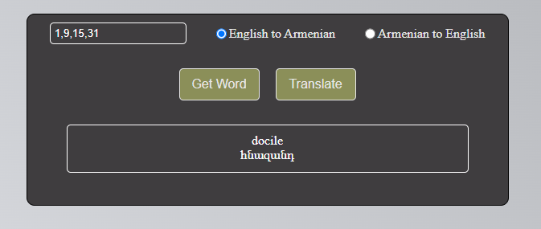

# English Learning App

---

This is a web application for learning English vocabulary through random word selection. Users can select a page or multiple pages from data.json and choose between English to Armenian or Armenian to English translation mode to learn new words.

**You can visit webpage [here!](https://studyingenglish.onrender.com)**

## Features

---
- Select a page/pages from a data.json (50 is last).
- Choose translation mode (English to Armenian or Armenian to English).
- Fetch random words for learning.
- Toggle translation display.
- **Words update every 2 weeks**

## Technologies Used

---
- Flask: Web framework for handling backend logic.
- HTML/CSS/JavaScript: Frontend development for user interface and interaction.
- Python for backend development
- Render: Deployment platform for hosting the web application.

## Usage

---
- Enter the page/pages you want to study in the input field.
- Select the translation mode (English to Armenian or Armenian to English).
- Click "Get Word" to fetch a random word for learning.
- Click "Translate" to toggle the translation display.

## Contributing

---
Contributions are welcome! If you'd like to contribute to this project, please follow these steps:

1. Fork the repository.
2. Create a new branch (`git checkout -b feature/new-feature`).
3. Make your changes and commit them (`git commit -am 'Add new feature'`).
4. Push to the branch (`git push origin feature/new-feature`).
5. Create a new Pull Request.

## License

---
This project is licensed under the MIT License - see the [LICENSE](LICENSE) file for details.
